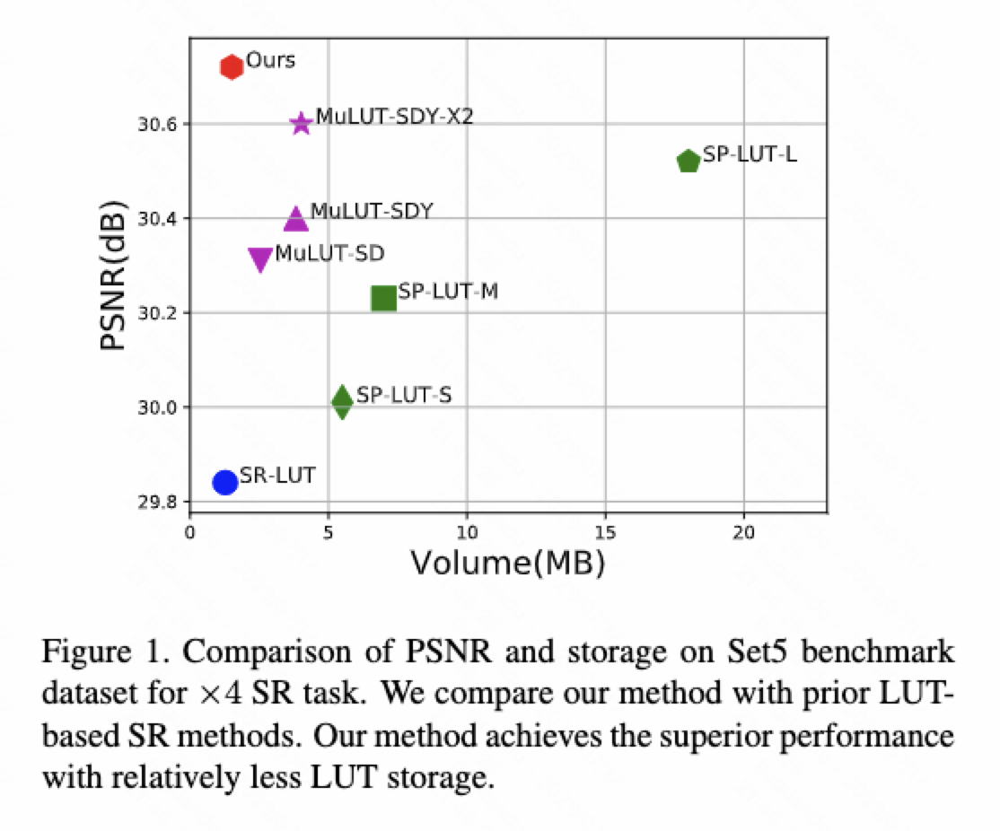

## Reconstructed Convolution Module Based Look-Up Tables for Efficient Image Super-Resolution

[Guandu Liu*], Yukang Ding, Mading Li, Ming Sun, Xing Wen and [Bin Wang#]

## Efficiency

## Overview
The core idea of our paper is RC Module.

### Dataset

Please following the instructions of [training](./data/DIV2K/README.md). And you can also prepare [SRBenchmark]()
### Installation
Clone this repo
```
git clone https://github.com/liuguandu/RC-LUT
```
Install requirements: torch>=1.5.0, opencv-python, scipy
### Train
First, please train RC network follow next code
```
sh ./sr/5x57x79x9MLP_combined.sh
```

updating...